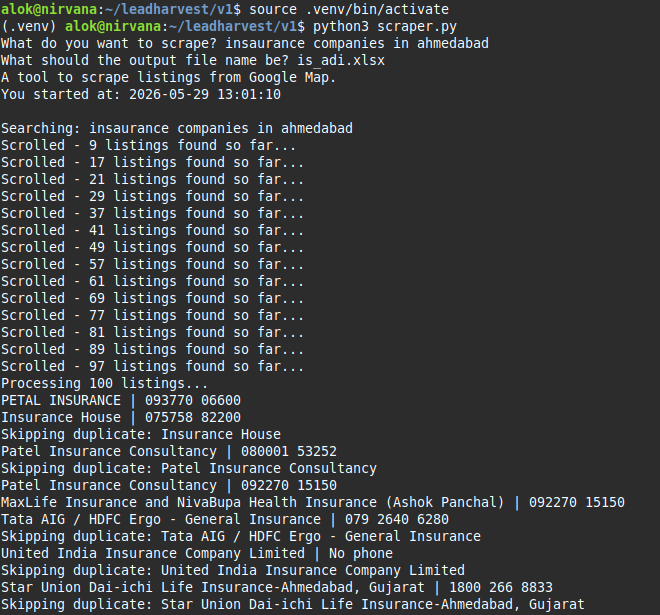
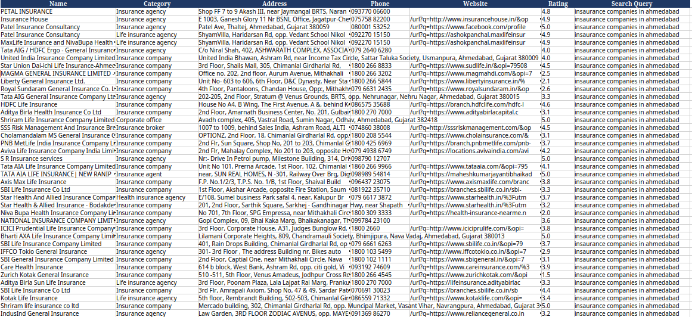

# LeadHarvest v1

A simple Google Maps scraper built using Playwright and Python.

This project was created as a learning exercise to understand:

* Browser automation using Playwright
* Async programming with Python
* Data extraction from dynamic websites
* Exporting structured data to Excel

The scraper searches Google Maps, collects business information, and saves the results into an Excel file.

---

## What it Scrapes

For each listing, the scraper attempts to collect:

* Business Name
* Category
* Address
* Phone Number
* Website
* Rating
* Search Query Used

The extracted data is saved into an Excel spreadsheet.

---

## How It Works

The main logic is contained in `scraper.py`.

### Step 1: Takes User Input

The script asks:

```text
What do you want to scrape?
What should the output file name be?
```

Example:

```text
What do you want to scrape? mexican restaurants in vadodara
What should the output file name be? mexican.xlsx
```

---

### Step 2: Opens Google Maps

The scraper launches a Chromium browser using Playwright and opens:

```text
https://www.google.com/maps/search/<query>
```

---

### Step 3: Load More Listings

Google Maps loads businesses dynamically while scrolling.

The scraper:

1. Finds the results panel
2. Scrolls repeatedly
3. Waits for new listings to load
4. Stops when:

   * Maximum result count is reached
   * No new listings appear

---

### Step 4: Extract Business Information

For every listing found:

1. Clicks the listing
2. Waits for the details panel to load
3. Extracts available information
4. Stores it in memory

---

### Step 5: Removes Duplicates

A simple deduplication strategy is used.

Businesses are considered duplicates if both:

* Name matches
* Phone number matches

Duplicate records are skipped.

---

### Step 6: Exports to Excel

The final data is written to an Excel workbook using OpenPyXL.

The spreadsheet contains:

| Column       |
| ------------ |
| Name         |
| Category     |
| Address      |
| Phone        |
| Website      |
| Rating       |
| Search Query |

---

## Structure

```text
v1/
│
├── scraper.py
├── requirements.txt
│
├── excel_sheets/
│   └── output files
│
└── screenshots/
    └── project screenshots
```

---

## Requirements

* Python 3.10+
* Playwright
* OpenPyXL

Install dependencies:

```bash
pip install -r requirements.txt
```

Install Playwright browser:

```bash
playwright install chromium
```

---

## Running the Project

### Linux

Create virtual environment:

```bash
python3 -m venv .venv
source .venv/bin/activate
```

Install dependencies:

```bash
pip install -r requirements.txt
playwright install chromium
```

Run:

```bash
python3 scraper.py
```

---

### Windows

Create virtual environment:

```powershell
python -m venv .venv
.venv\Scripts\activate
```

Install dependencies:

```powershell
pip install -r requirements.txt
playwright install chromium
```

Run:

```powershell
python scraper.py
```

---

### macOS

Create virtual environment:

```bash
python3 -m venv .venv
source .venv/bin/activate
```

Install dependencies:

```bash
pip install -r requirements.txt
playwright install chromium
```

Run:

```bash
python3 scraper.py
```

---

## Example

Input:

```text
What do you want to scrape? digital marketing agencies in mumbai
What should the output file name be? agencies.xlsx
```

Output:

```text
Saved 100 records to 'excel_sheets/agencies.xlsx'
```

---

## Limitations

* Depends on the current Google Maps page structure.
* Selectors may break if Google changes their UI.
* Not intended for large-scale scraping.
* Some listings may not contain phone numbers or websites.
* Results can vary based on location and Google Maps personalization.

---

## Why This Exists

This is Version 1 of the project.

The goal was not to build a production-grade scraper but to understand:

* Browser automation
* Dynamic content scraping
* Async workflows
* Data cleaning
* Excel export pipelines

It serves as the prototype/foundation for future, more advanced versions.

## Screenshots



