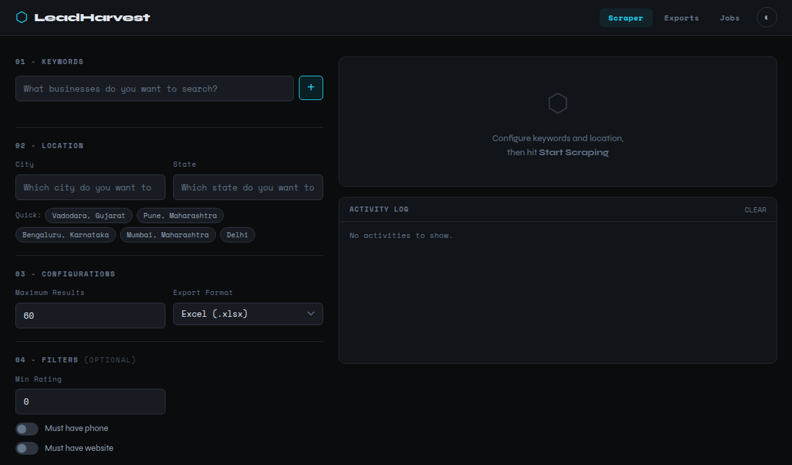
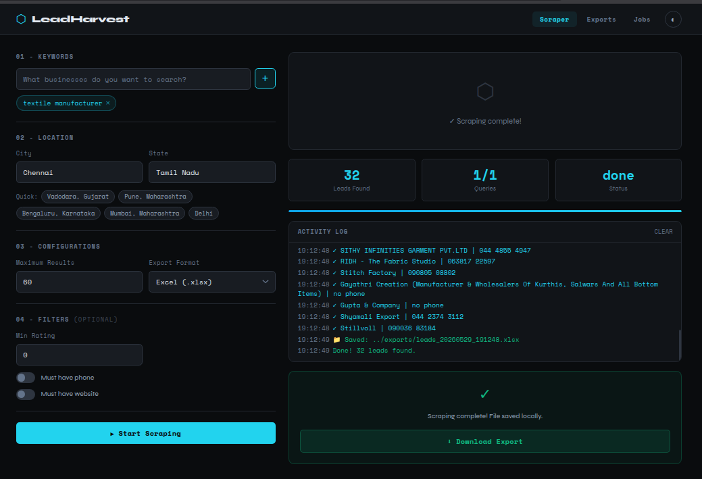

# LeadHarvest v2

**Local-first Google Maps lead scraper with a clean web UI.**
Search multiple keywords × locations, filter results, and export to Excel/CSV/JSON, all on your machine, no cloud required. This version was developed by iterating on the original prototype and making extensive use of modern AI-assisted development workflows.

Search for any keyword in any location and save the result to excel sheet.

---

## Screenshots



---

## Features

| Feature | Detail |
|---|---|
| Multi-keyword search | Add any number of keywords per scrape |
| Location filtering | City + state with fuzzy address validation — eliminates cross-state results |
| Smart deduplication | Deduped by phone number, then by name+address |
| Phone normalization | Strips formatting noise from raw phone strings |
| Smart filters | Min rating, must have phone, must have website |
| Real-time UI | Polling-based progress log in the browser |
| Stop anytime | Cancel mid-scrape; partial results are still saved |
| Export formats | Excel (.xlsx), CSV (.csv), JSON (.json) |
| Timestamped exports | Auto-named exports, never overwrite each other |
| Job history | Browse past scrape jobs and their results |
| Dark/light mode | Toggleable in the top-right corner |
| **100% local** | No telemetry, no cloud, no account needed |

---

## Architecture

```
v2/
├── backend/                  # FastAPI Python backend
│   ├── main.py               # App entry point + static serving
│   ├── routers/
│   │   ├── scraper.py        # POST /api/scraper/start, cancel
│   │   ├── jobs.py           # GET/DELETE /api/jobs/{id}
│   │   └── exports.py        # GET /api/exports/, download, delete
│   ├── services/
│   │   ├── scraper_service.py  # Playwright scraper, location validation
│   │   ├── job_manager.py      # In-memory job tracking
│   │   └── export_service.py   # xlsx/csv/json writers
│   └── utils/
│       └── logger.py           # Structured logging setup
│
├── frontend/
│   ├── templates/index.html  # Single-page app shell
│   └── static/
│       ├── css/app.css       # Syne + Space Mono, dark/light theme
│       └── js/app.js         # Polling, tags, panel nav, downloads
│
├── exports/                  # All generated export files (gitignored)
├── logs/                     # Application logs (gitignored)
├── requirements.txt
├── .env.example
├── .gitignore
├── install.sh                # Mac/Linux one-command installer
└── install.bat               # Windows one-command installer
```

### How a scrape works

1. User fills in keywords, city/state, and optional filters in the UI
2. Frontend POSTs to `/api/scraper/start` → background task is queued
3. Playwright launches headless Chromium, navigates to Google Maps
4. Listings are scrolled into view, clicked, and each field is extracted
5. Every lead's address is fuzzy-matched against the target city/state — mismatches are discarded
6. Results are deduplicated and written to `exports/`
7. Frontend polls `/api/jobs/{id}` every ~1.8 s and renders live progress
8. Done: export file is ready to download

---

## Installation

### Requirements

- Python 3.10+
- ~300 MB disk space (Chromium browser)

### Mac / Linux

```bash
git clone https://github.com/yourname/leadharvest.git
cd leadharvest
chmod +x install.sh
./install.sh
```

### Windows

```
git clone https://github.com/yourname/leadharvest.git
cd leadharvest
install.bat
```

---

## Running

```bash
# Activate virtual environment
source .venv/bin/activate          # Mac/Linux
.venv\Scripts\activate             # Windows

# Start the backend
cd backend
uvicorn main:app --reload
```

Open **http://127.0.0.1:8000** in your browser.

---

## Usage

1. **Keywords** - type a keyword and press Enter or click `+`. Add multiple.
2. **Location** - enter a city and state. Use quick-fill chips for common cities.
3. **Max Results** - how many listings to scrape per keyword (5–200).
4. **Export Format** - Excel, CSV, or JSON.
5. **Filters** - optionally set min rating or require phone/website.
6. Click **Start Scraping**.
7. Watch the live log. Click **Stop** anytime.
8. When done, click **⬇ Download Export** or go to the Exports tab.

---

## Privacy

**LeadHarvest is 100% local-first:**

- No analytics, no telemetry, no crash reporting
- No account or API key required
- All exports are written to your local `exports/` folder (gitignored)
- All logs go to your local `logs/` folder (gitignored)
- The only outbound connections are the Playwright browser navigating Google Maps — no data is sent to any third party
- Uninstall by deleting the project folder

---

## Limitations

- Google Maps HTML structure can change without notice - selectors may need updating
- Scraping is intentionally throttled; very high `max_results` values take longer
- Only Google Maps is supported in v1
- Playwright requires Chromium (~280 MB)
- Not suitable for scraping millions of records (rate-limiting risk)

---

## Troubleshooting

| Problem | Fix |
|---|---|
| `playwright install` fails | Run `playwright install-deps` first on Linux |
| Browser never opens | Ensure Chromium installed: `playwright install chromium` |
| Wrong city results appearing | Enable location filtering; results from nearby states are filtered by address fuzzy-match |
| No results found | Try a broader keyword or remove city/state restriction |
| `ModuleNotFoundError` | Make sure venv is activated before running uvicorn |


## Contributing

Pull Requests and suggestions regarding optimisation are welcome.

---

## License

MIT
